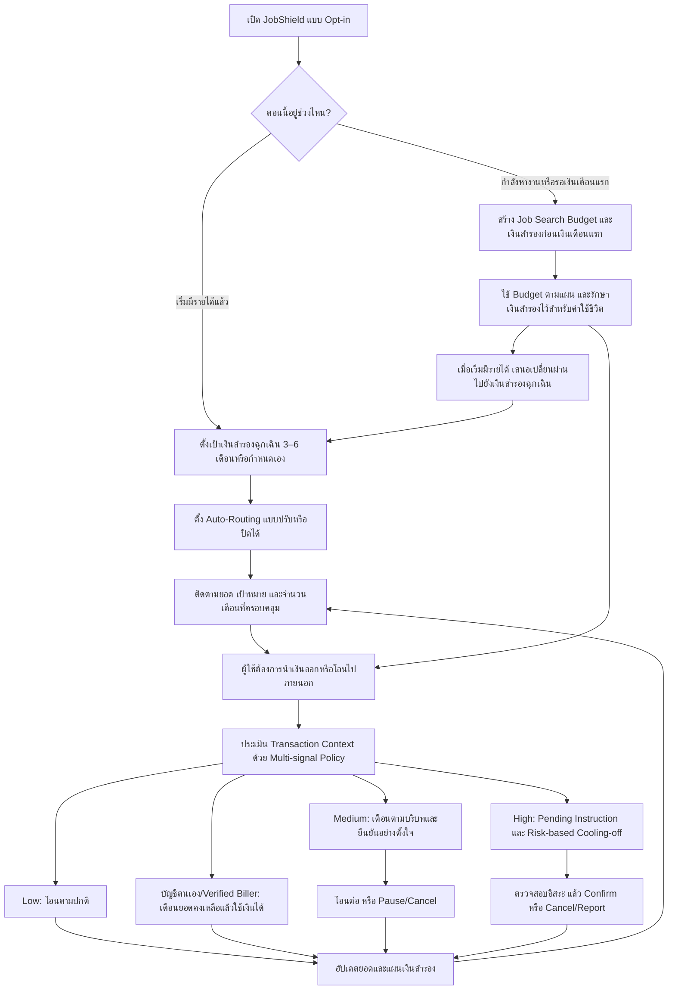

# K PLUS JobShield — Old/New Concept Alignment Plan

Status: Complete — approved by user and implemented on 6 September 2026

> Subsequent decisions: หลังแผนนี้เสร็จ ผู้ใช้ตัด `Job Search Budget` และต่อมาตัด Stage branching/การเปลี่ยนชื่อ Pocket ทั้งหมด Current scope จึงใช้ `เงินสำรองตั้งหลัก` ก้อนเดียวตาม `Current Scope Lock — One Continuous Reserve (V5)` ใน project decision log

## Summary

ปรับแนวคิดให้ `K PLUS JobShield` เป็นผลิตภัณฑ์เดียวที่มีวงจร `Build → Protect → Continue` แทนการวาง “ระบบป้องกัน Fake Recruiter” และ “ระบบออมเงินฉุกเฉิน” เป็นสองฟีเจอร์แยกกัน โดยยังให้ Track 3 เป็นแกนหลัก: JobShield ช่วยสร้างบริบทของเงินผ่าน K-ePocket และใช้บริบทนั้นร่วมกับสัญญาณธุรกรรมเพื่อแทรกแซงก่อนเงินออก ส่วน Auto-Routing เป็นกลไกสร้างเงินสำรอง ไม่ใช่ความใหม่ด้าน Cyber Security ด้วยตัวมันเอง

## Clarifying Questions

- [x] ต้องเพิ่ม Auto-Routing และเงินสำรองฉุกเฉินใน Prototype หรือไม่? → ผู้ใช้ยืนยันว่าต้องการเพิ่ม
- [x] สามารถตัดหรือรวมฟังก์ชันเดิมเพื่อให้ Flow ใหม่ชัดขึ้นหรือไม่? → ผู้ใช้อนุญาต
- [x] ต้องสร้าง Final Proposal ใหม่ในรอบนี้หรือไม่? → ไม่ได้ร้องขอ จึงเก็บ PDF เดิมเป็น snapshot และวางแผนอัปเดตเฉพาะ non-final artifacts

## Grill-Me Outcome

- Skipped for this alignment pass: แนวคิดหลักและ security boundaries ผ่านการตัดสินใจจากคำถาม 36 ข้อก่อนหน้าแล้ว รอบนี้เป็นการลด/รวมขอบเขตตามคำสั่งล่าสุด ไม่ได้เพิ่ม dependency ด้านข้อมูลหรืออำนาจธนาคารใหม่

## Product Decision

### Positioning ใหม่

> `K PLUS JobShield ช่วย First Jobbers สร้างเงินสำรองอย่างต่อเนื่อง และเพิ่มการป้องกันตามความเสี่ยงเมื่อเงินสำคัญกำลังถูกโอนไปยังปลายทางภายนอก`

แนวคิดเดิมเรื่อง Fake Recruiter จะถูกเก็บเป็น **Hero Threat Scenario** ที่อธิบายว่าทำไมต้องมีการป้องกันก่อนโอน แต่ไม่บังคับให้ผลิตภัณฑ์ทั้งระบบใช้ได้เฉพาะช่วงสมัครงาน

### โครงผลิตภัณฑ์ที่เหลือ 3 ส่วน

1. **Set up — เลือกช่วงชีวิตและจัดเงิน**
   - กำลังหางาน/รอเงินเดือนแรก: สร้าง `Job Search Budget` และ `เงินสำรองก่อนเงินเดือนแรก` แบบ One-tap ผ่าน K-ePocket
   - เริ่มมีรายได้แล้ว: สร้าง `เงินสำรองฉุกเฉิน` และกำหนดเป้าหมายจากค่าใช้จ่ายจำเป็นประมาณ 3–6 เดือนหรือกำหนดเอง
2. **Build — สร้างเงินสำรอง**
   - Auto-Routing แบบ opt-in เป็นจำนวนคงที่หรือเปอร์เซ็นต์
   - ผู้ใช้ปรับ พัก ปิด และกำหนดให้หยุดเมื่อถึงเป้าหมายได้
   - Dashboard แสดงยอด เป้าหมาย และจำนวนเดือนที่ครอบคลุม
3. **Protect — ป้องกันก่อนเงินออก**
   - ใช้แหล่งเงิน ผู้รับใหม่/เดิม รูปแบบยอดสะสม และ Destination Risk ฝั่งธนาคารมาประเมินร่วมกัน
   - Low: ทำรายการตามปกติ
   - Medium: Contextual Warning และให้ยืนยันอย่างตั้งใจ
   - High: พักเฉพาะ Pending Instruction ก่อนเข้าสู่ PromptPay ใช้ Risk-based Cooling-off และมี Cancel/Report
   - บัญชีตนเองหรือ Verified Biller ใช้เงินฉุกเฉินได้โดยไม่มี High-Risk delay แบบตายตัว

## Revised End-to-End Flow

## Separation Of Concerns

ต้องแยกการเตือนสองประเภทเพื่อไม่ให้ผู้ใช้เข้าใจผิด:

| การแทรกแซง | เหตุผล | บังคับหรือไม่ |
|---|---|---|
| `Savings Nudge` | การถอนทำให้เงินสำรองลดลงหรือไม่ตรงเป้าหมาย | ไม่บังคับ ผู้ใช้ทำต่อได้ทันที |
| `Fraud/Scam Intervention` | พบสัญญาณธุรกรรมหรือปลายทางเสี่ยงหลายข้อร่วมกัน | ใช้ friction ตามระดับความเสี่ยง; High ต้องผ่าน Cooling-off/verification |

ตัวละครที่เป็นมิตรใช้ได้กับ Savings Nudge และคำอธิบายความเสี่ยง แต่ต้องไม่ทำให้ High-Risk warning ดูเล่นเกินไป และสีต้องไม่เป็นสัญญาณเพียงอย่างเดียว

## Functions To Keep, Merge, Move Or Cut

### Keep In Core Prototype

- K-ePocket สำหรับแยกวัตถุประสงค์ของเงิน
- Job Search Budget, เงินสำรองก่อนเงินเดือนแรก และการเปลี่ยนผ่านเป็นเงินสำรองฉุกเฉิน
- เป้าหมายเงินสำรอง 3–6 เดือน/กำหนดเอง
- Auto-Routing แบบ opt-in พร้อม cap, pause และ off
- Multi-signal pre-transfer policy
- Contextual Warning, Pending Instruction, Risk-based Cooling-off และ Cancel/Report
- Emergency/false-positive path สำหรับบัญชีตนเองและ Verified Biller
- Savings Nudge แบบกดข้ามได้สำหรับการใช้จ่ายทั่วไป

### Merge

- `Dynamic Time Lock` รวมอยู่ใน Risk-based Cooling-off เท่านั้น
- `Career Mode` เปลี่ยนบทบาทจากสวิตช์หลักของผลิตภัณฑ์เป็น `career stage/context` ที่ผู้ใช้เลือกตอนตั้งค่า JobShield
- Warning ถอนเงินสำรองเดิมแยกเป็น Savings Nudge หรือ Fraud/Scam Intervention ตามเหตุผลจริง
- เงินที่เหลือจากช่วงก่อนเงินเดือนแรกสามารถนำไปเริ่มเป้าหมายเงินสำรองฉุกเฉินได้เมื่อผู้ใช้ยืนยัน ไม่ย้ายอัตโนมัติ

### Future Concept Only

- K Point หรือ milestone reward ที่ต้องผ่าน Business/Product approval
- การตรวจจับเงินเดือนอัตโนมัติ หากยังไม่ยืนยันข้อมูล/API ภายใน
- Employer verification network, Email/Link scanning และ Fraud Specialist workflow

### Cut From Current Prototype/Proposal

- ดอกเบี้ยพิเศษหรืออัตราผลตอบแทนแบบขั้นบันได
- Claim ว่าธนาคารสามารถนำเงินก้อนนี้ไปลงทุนต่อได้โดยตรง
- AI/ML terminology เมื่อ MVP ยังใช้ deterministic rules
- Escrow, Safe Zone/GPS/Wi-Fi restriction และการล็อกทั้งบัญชีหรือทั้ง Pocket
- การเตือนทุกครั้งที่ Auto-Routing ทำงาน เพราะเสี่ยง Alert Fatigue

## Core Prototype Story

Prototype หลักใช้เรื่องเดียวเพื่อไม่ให้ขอบเขตกว้างเกินไป:

1. ผู้ใช้กำลังหางานและเปิด JobShield
2. สร้าง Job Search Budget กับเงินสำรองก่อนเงินเดือนแรก
3. Fake Recruiter ขอให้จ่ายค่าอุปกรณ์ไปยังบัญชีบุคคลใหม่
4. JobShield ตรวจหลายสัญญาณและพัก Pending Instruction ก่อนเงินออก
5. ผู้ใช้ Cancel/Report จึงรักษาเงินสำรองไว้ได้
6. หลังเริ่มงาน ผู้ใช้ตั้งเป้าเงินสำรองฉุกเฉินและ Auto-Routing
7. เมื่อจำเป็นต้องจ่ายค่ารักษาไปยัง Verified Biller ผู้ใช้เข้าถึงเงินได้โดยไม่มี High-Risk delay

เส้นเรื่องนี้พิสูจน์ทั้ง `Build` และ `Protect` โดยยังมี Threat, Detection, Control และ False-positive handling ที่ชัดเจนสำหรับ Track 3

## File And Code References

- `docs/plans/2026-09-03-k-plus-track-3-concept-decision.md` — scope lock และ decision log เดิม
- `prototype/protected-savings-extension-spec.md` — Auto-Routing, reserve target, nudge และ withdrawal paths
- `prototype/jobshield-integrated-lifecycle-v3.drawio` — Diagram ปัจจุบันที่ต้องปรับให้ใช้โครง Set up/Build/Protect
- `prototype/figma-flow-spec.md` — screen inventory และ interaction map เดิม
- `research/threat-model.md` — asset/threat boundary ที่ต้องเพิ่มเงินสำรองฉุกเฉิน
- `research/synthetic-risk-table.md` — policy schema ที่ต้องรองรับ protected reserve ทั้งสองช่วง
- `proposal/content-skeleton.md` — non-final one-page content ที่ต้องย่อให้ใช้ positioning ใหม่โดยไม่ทำให้ Track 3 อ่อนลง
- `proposal/Test_ Final-Proposal-1.pdf` — เก็บเป็น snapshot เดิม; ไม่เขียนทับในรอบนี้

## Plan Todos

- [x] อัปเดต decision log ให้ใช้ positioning `Build → Protect → Continue` และ career stage แทน Career Mode ที่เป็นสวิตช์หลัก
- [x] ปรับ threat model และ synthetic risk table ให้ `เงินสำรองฉุกเฉิน` เป็น protected fund source เพิ่มเติม โดย reserve withdrawal เพียงอย่างเดียวไม่ทำให้เป็น High
- [x] รวม `protected-savings-extension-spec.md` เข้ากับ flow หลัก และติดป้าย K Point/automatic salary detection เป็น Future
- [x] ปรับ Figma flow spec ให้ลดหน้าซ้ำและแยก Savings Nudge ออกจาก Fraud/Scam Intervention
- [x] สร้าง Draw.io เวอร์ชันถัดไปโดยใช้ 3 หน้า: Product Lifecycle, Build Reserve, Protect Transfer และไม่ลากเส้นข้าม lane
- [x] ปรับ non-final content skeleton ให้สื่อ “สร้างและปกป้องเงินสำรอง” แต่ใช้ Fake Recruiter เป็น Hero Threat Scenario
- [x] เก็บ Test Final Proposal 1 และ Diagram v3 เป็น prior snapshot; สร้างไฟล์เวอร์ชันใหม่แทนการเขียนทับ

## Build From Plan

- Ready to build: Completed
- Selected todos: All approved todos implemented
- Execution notes: ใช้ข้อมูลสมมติเท่านั้น ไม่ได้แก้ Figma canvas และไม่ได้สร้าง Final Proposal/PDF ใหม่ในรอบนี้

## Validation

- ตรวจคำศัพท์ในไฟล์ใหม่ด้วย `rg`: Career Mode, AI, ดอกเบี้ย, K Point, Fraud Specialist, Email/Link, เงินสำรองก่อนเงินเดือนแรก และเงินสำรองฉุกเฉิน
- Validate Draw.io XML ว่าเปิดได้ ไม่มี duplicate ID หรือ broken source/target reference
- Export PNG ทุกหน้าและตรวจด้วยภาพจริงว่าไม่มีเส้นทับกล่อง ข้อความไม่ล้น และเส้นทาง Low/Medium/High แยกชัด
- ตรวจว่า Prototype ยังแสดง `0 pilot sessions conducted` และ `0 participant sessions conducted` จนกว่าจะมีการทดสอบจริง
- ตรวจว่า High-Risk flow พักเฉพาะคำสั่งและยอดนั้นก่อนเข้าสู่ PromptPay ไม่ล็อกทั้ง Pocket

## Risks

- หากนำ Build/Gamification ขึ้นเป็นพระเอกมากเกินไป Proposal จะดูเป็น Personal Finance หรือ Track 2 แทน Track 3
- Auto-Routing และ Pocket ไม่ใช่ novelty โดยลำพัง; differentiation ยังต้องอยู่ที่ context-aware pre-transfer policy
- การรวมช่วงหางานและหลังมีรายได้อาจทำให้ Flow ยาว จึงต้องใช้หนึ่ง Hero Scenario และแยกรายละเอียดเป็นคนละหน้า
- K Point, ดอกเบี้ย และ automatic salary recognition ยังไม่มี production/business confirmation
- Savings Nudge ที่ถี่เกินไปจะสร้าง Alert Fatigue และทำให้ผู้ใช้กดผ่านคำเตือน Scam จริง

## Approval State

Approved by user. All listed Plan Todos completed; V4 artifacts are the current repository specification while the live Figma canvas remains a prior snapshot.
