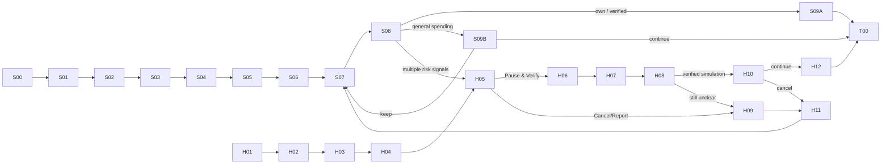

# K PLUS JobShield — V5 Clickable Flow Specification

> Superseded for current build by figma-flow-spec-v6.md. Retained as a V5 snapshot.

สถานะ: **V5 REPOSITORY SPEC READY — NOT APPLIED TO FIGMA CANVAS**

วันที่: 6 กันยายน 2026

Target: [K PLUS JobShield — Clickable Prototype](https://www.figma.com/design/5uoF2s6cq2JMGRFfwmdpc2)

เจ้าของ final visual: สมาชิกคนที่สอง

## V5 Scope Lock

- ใช้ชื่อเดียวตลอด Flow: `เงินสำรองตั้งหลัก (Protected Reserve)`
- ไม่มี career-stage selection และไม่มีการเปลี่ยนชื่อ/ย้าย Pocket เมื่อผู้ใช้เริ่มมีรายได้
- ไม่มี `Job Search Budget`
- ผู้ใช้สร้างหรือเชื่อม K-ePocket ก้อนเดียว ตั้งเป้าจากค่าใช้จ่ายจำเป็น 3/6 เดือนหรือกำหนดเอง และเติมยอดเริ่มต้นได้
- Auto-Routing เปิดตอนนี้หรือภายหลังได้ ปรับ พัก ปิด และหยุดเมื่อถึงเป้าหมายได้
- Core มี 3 integrations: K-ePocket, K PLUS Transaction + Bank-side Fraud Risk และ K PLUS Security & Fraud Response
- Email/Link scanning และ Fraud Specialist ไม่อยู่ใน Core
- Prototype ใช้ deterministic policy + synthetic data ไม่มี ML model
- Savings Nudge กดข้ามได้และไม่สร้าง Pending Instruction
- High-Risk Cooling-off พักเฉพาะคำสั่งและยอดรายการนั้นก่อนเข้าสู่ PromptPay

## File Structure

```text
00 Cover & Instructions
01 Foundations & Components
02 Clickable Prototype
   ├── Set up & Build — S00–S07
   ├── Withdraw — S08–S09B
   ├── Protect — H01–H12
   └── Test states & start points
```

## Components

| Component | Variants |
|---|---|
| `ProtectedReserveCard` | empty / starting / building / goal-reached / after-withdrawal |
| `AutoRoutingRuleCard` | off / setup / active / paused / goal-reached |
| `FundSourceCard` | บัญชีหลัก / เงินสำรองตั้งหลัก |
| `PayeeRow` | own / known / verified biller / new unverified |
| `RiskBanner` | Medium / High |
| `ReasonChip` | new payee / protected reserve / repeated / destination / job payment |
| `PauseStatus` | held / verifying / eligible-to-continue / cancelled |
| `WithdrawalNudge` | general spending only |
| `PrototypeTag` | simulation / assumption / future concept |

## Global Interaction Rules

- Back preserves synthetic input until the user cancels the task
- Auto-Routing consent is not preselected
- `ไว้ภายหลัง` keeps Auto-Routing off without blocking reserve setup
- normal Auto-Routing shows a quiet receipt, not a Scam warning
- purpose answer can add context but cannot lower a tier created by other signals
- `Pause & Verify` creates one idempotent Pending Instruction before PromptPay
- repeated taps cannot create duplicate instructions or bypass Cooling-off
- `Cancel transfer` states clearly that the instruction was not sent
- High continuation stays unavailable until the prototype simulates an agreed verification/cooling-off condition
- no screen claims a fixed cooling-off duration, production score, model accuracy or guaranteed protection

## Flow S — Set Up, Build And Withdraw

| ID | Screen | Primary interaction | Destination |
|---|---|---|---|
| S00 | JobShield introduction: สร้างเงินสำรองและเพิ่มเกราะก่อนโอน | `เริ่มตั้งค่า` | S01 |
| S01 | Check K-ePocket | existing → choose pocket; missing → create one pocket | S02 |
| S02 | Essential monthly expense | enter synthetic amount | S03 |
| S03 | Target: 3 / 6 / custom months | choose target | S04 |
| S04 | Starting amount from existing funds | confirm amount or start at zero | S05 |
| S05 | Auto-Routing: fixed amount / percentage / later | configure or skip | S06 |
| S06 | Review and explicit consent | confirm plan | S07 |
| S07 | Reserve Dashboard | edit/pause/off or withdraw | S05/S08 |
| S08 | Withdrawal context: amount, destination, broad purpose | select route | S09A/S09B/H05 |
| S09A | Own account or verified biller, neutral risk | normal confirmation | T00 |
| S09B | General-spending Savings Nudge | keep / continue | S07/T00 |

Copy constraints:

- `เงินสำรองตั้งหลัก` เป็น K-ePocket ที่กำหนดวัตถุประสงค์ ไม่ใช่บัญชีเงินฝากชนิดใหม่
- ไม่ถามว่าผู้ใช้มีงานหรือได้รับเงินเดือนแล้วหรือยัง
- ไม่อ่านข้อความ อีเมล หรือ Resume
- ผู้ที่ยังไม่มีรายได้สามารถเติมยอดเริ่มต้นและเลือกเปิด Auto-Routing ภายหลังได้
- K Point ติดป้าย Future Concept และไม่แสดงอัตราหรือสิทธิที่รับรองแล้ว

## Flow H — Fake Recruiter Hero Scenario

Synthetic fixture: โอน ฿7,900 จาก `เงินสำรองตั้งหลัก` ไปยังผู้รับบุคคลใหม่เพื่อจ่ายค่าอุปกรณ์ก่อนเริ่มงาน พร้อม simulated elevated destination risk

| ID | Screen | Primary interaction | Destination |
|---|---|---|---|
| H01 | Enter new-payee transfer | `ถัดไป` | H02 |
| H02 | Choose source | select `เงินสำรองตั้งหลัก` | H03 |
| H03 | Review transfer | `ตรวจสอบก่อนโอน` | H04 |
| H04 | Broad context question, skippable | select job fee or skip | H05 |
| H05 | High-Risk contextual warning | `Pause & Verify` / `Cancel/Report` | H06/H09 |
| H06 | Pending Instruction: ยังไม่ส่งเข้าสู่ PromptPay | independent verification | H07 |
| H07 | Verify through independently found official channel | simulate result | H08 |
| H08 | Verified / still unclear | choose outcome | H10/H09 |
| H09 | Cancel and report | confirm | H11 |
| H10 | Final deliberate confirmation after condition | continue / cancel | H12/H11 |
| H11 | Cancelled; instruction not sent | return | S07 |
| H12 | Transfer complete — simulation only | end | T00 |

H05 reasons, maximum three:

- `คุณยังไม่เคยโอนให้ผู้รับนี้`
- `รายการนี้ใช้เงินสำรองตั้งหลัก`
- `รายการนี้เกี่ยวข้องกับค่าใช้จ่ายก่อนเริ่มงาน`

Impact: `หากทำรายการ เงินสำรองตั้งหลักของคุณจะลดลง ฿7,900`

ห้ามใช้คำว่า `ตรวจพบมิจฉาชีพ`, `ปลอดภัย 100%`, risk percentage หรือ countdown ที่ไม่มีหลักฐาน

## Legitimate And False-Positive Test Paths

| Scenario | Inputs | Expected action |
|---|---|---|
| Verified rent/bill | เงินสำรองตั้งหลัก + verified biller + neutral risk | normal flow; no Scam warning |
| Own-account access | เงินสำรองตั้งหลัก + own account + neutral risk | normal flow; no fixed delay |
| Essential expense to new payee | new unverified + neutral risk, no other High signals | Medium contextual warning; deliberate confirmation allowed |
| General purchase to known payee | known payee + neutral risk | dismissible Savings Nudge only |
| Coached purpose bypass | protected reserve + new payee + repetition/elevated risk; purpose=other | remains High |

## Link Map



## Testing Start Points

- `START-SETUP` → S00
- `START-AUTOROUTING` → S05
- `START-WITHDRAW` → S08
- `START-HIGH-CONTEXTUAL` → H01
- `START-HIGH-GENERIC` → generic-warning matched fixture
- `START-LEGIT-VERIFIED` → verified rent/bill fixture
- `START-OWN-ACCESS` → own-account fixture
- `START-GENERAL-NUDGE` → general purchase fixture

## Build And Pilot Gate

- [ ] Apply V5 screens/copy to Figma canvas
- [ ] Remove Stage selection and all V4 reserve names from current presentation paths
- [ ] Verify every link and start point in Present mode
- [ ] Check Thai text overflow, contrast, text scaling and 44 px touch targets
- [ ] Human visual owner signs `READY FOR PILOT`
- [ ] Pilot with one real participant before the 5–8 participant sessions

Current research status remains `0 pilot sessions conducted` and `0 participant sessions conducted`.
