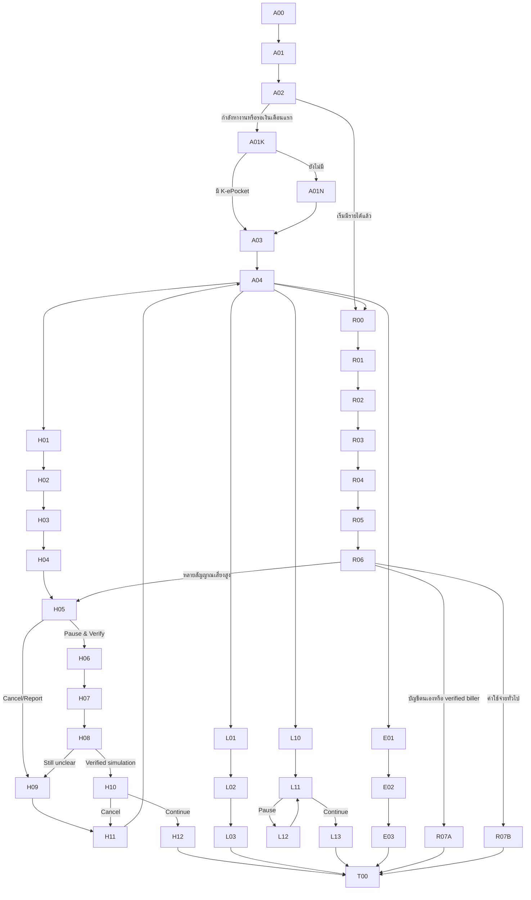

# K PLUS JobShield — Figma-Ready Clickable Flow Specification

> Superseded on 6 September 2026 by [figma-flow-spec-v6.md](./figma-flow-spec-v6.md). ไฟล์นี้เก็บ V4 ที่เคยแบ่ง lifecycle ก่อน/หลังเงินเดือนไว้เป็น prior specification ห้ามใช้เป็น current scope

สถานะ: V4 repository specification approved and synced 6 กันยายน 2026; existing clickable canvas remains the prior 31-screen snapshot and V4 is **not yet applied**
เจ้าของ final visual: สมาชิกคนที่สอง  
ขอบเขต: screen inventory, component states, prototype links และ test data สำหรับ clickable flow  
ไม่ใช่: official K PLUS design system หรือ final Proposal

ไฟล์เป้าหมาย: [K PLUS JobShield — Clickable Prototype](https://www.figma.com/design/5uoF2s6cq2JMGRFfwmdpc2)  
Workspace: Drafts ใน `Re: Verse's team`  
Implementation note: V4 คงโครงสร้าง Figma 3 pages (`00 Cover & Instructions`, `01 Foundations`, `02 Clickable Prototype`) แต่จัด section ในหน้าสุดท้ายเป็น `Set up`, `Build`, `Protect` และ `Test states` เพื่อให้เส้น prototype ไม่ไขว้กัน

## V4 Scope Lock

- คำบนหน้าจอแยก `เงินสำรองก่อนเงินเดือนแรก` ออกจาก `เงินสำรองฉุกเฉิน` ชัดเจน
- Core เชื่อม 3 ส่วนเท่านั้น: `K-ePocket`, `K PLUS Transaction + Bank-side Fraud Risk` และ `K PLUS Security & Fraud Response`
- `Dynamic Time Lock` เป็นกลไกภายใน risk-based Cooling-off ไม่ใช่ฟีเจอร์แยก
- High-Risk Cooling-off พักเป็น `Pending Instruction` ก่อนส่งเข้าสู่ระบบโอน/PromptPay
- Email/Link scanning และ Fraud Specialist เป็น Optional/Future integration และไม่อยู่ใน Core flow
- Prototype ใช้ deterministic rules/policy กับ synthetic data; ไม่มี ML model และไม่แสดงผลลัพธ์เสมือนว่ามาจากโมเดลจริง
- ผู้ใช้ไม่ต้องมี K-ePocket มาก่อน; JobShield onboarding ให้เลือก `career stage` แล้วสร้าง/เชื่อม Pocket ที่เหมาะกับช่วงนั้น
- `Career Mode` ไม่เป็นสวิตช์หลักอีกต่อไป แต่เปลี่ยนเป็น career stage/context: `กำลังหางาน/รอเงินเดือนแรก` หรือ `เริ่มมีรายได้แล้ว`
- Current prototype ใช้ protected reserve เพียงก้อนเดียว: `เงินสำรองก่อนเงินเดือนแรก` เปลี่ยนเป็น `เงินสำรองฉุกเฉิน` เมื่อผู้ใช้ยืนยันหลังเริ่มมีรายได้; ไม่มี `Job Search Budget`
- หลังเริ่มมีรายได้ ผู้ใช้ตั้งเงินสำรองฉุกเฉินและ Auto-Routing แบบ opt-in ซึ่งปรับ พัก ปิด และหยุดเมื่อถึงเป้าหมายได้
- แยก `Savings Nudge` ที่กดข้ามได้ออกจาก `Fraud/Scam Intervention`; Nudge ห้ามสร้าง Pending Instruction
- K Point เป็น Future Concept ที่ต้องผ่าน Business/Product approval; ดอกเบี้ยพิเศษถูกตัดออกจาก Prototype

## Prototype Goal

ทำให้ผู้ทดสอบเข้าใจภายใน flow เดียวว่า JobShield:

1. เลือกช่วงชีวิตและจัดเงินผ่าน K-ePocket โดยไม่ต้องมี Pocket มาก่อน
2. สร้างเงินสำรองฉุกเฉินด้วยเป้าหมายและ Auto-Routing ที่ผู้ใช้ควบคุมได้
3. ประเมินบริบทก่อนโอนโดยไม่อ่านข้อความส่วนตัว
4. แยก Savings Nudge ออกจาก Fraud/Scam Intervention และใช้ friction ต่างกันสำหรับ legitimate, suspicious และ emergency transactions

## File Structure

```text
00 Cover & Instructions
01 Foundations & Components
02 Clickable Prototype
   ├── Set up — Career stage & K-ePocket
   ├── Build — Emergency reserve & Auto-Routing
   ├── Protect — Low / Medium / High / Emergency
   └── Test states & start points
```

## Provisional Foundations

ใช้เป็น accessibility guardrails ไม่ใช่ official KBank tokens:

- Frame: mobile 390 × 844
- Layout grid: 4 columns, 16 px margins, 8 px spacing unit
- Type: Thai-capable sans-serif; 24 px page title, 20 px section title, 16 px body/button, 14 px supporting text
- Touch target: minimum 44 × 44 px
- Semantic colors: neutral/default, caution, critical, success; ทุก state ต้องมี label/icon ร่วมกับสี
- Contrast: body/action text เป้าหมาย WCAG AA; visual owner ตรวจด้วย Figma contrast plugin หรือ equivalent
- Components: Auto Layout และ variants เพื่อรองรับข้อความไทย/text scaling

## Component Inventory

| Component | Required variants | Content/data |
|---|---|---|
| `JobShieldStageCard` | job-search / waiting-first-salary / earning / off | stage, protected funds, Manage action |
| `FundSourceCard` | บัญชีหลัก / เงินสำรองก่อนเงินเดือนแรก / เงินสำรองฉุกเฉิน | available amount, purpose label |
| `PayeeRow` | own / known / verified biller / new unverified | name fixture, account alias, status text |
| `ReasonChip` | new payee / reserve / repeated / destination / job context | icon + plain Thai reason |
| `RiskBanner` | Medium / High | heading, maximum 3 reasons, no numeric score |
| `ActionButton` | primary / secondary / destructive / disabled | label and loading state |
| `PauseStatus` | held / verifying / eligible-to-continue / cancelled | explicit `พักคำสั่งไว้ก่อนส่งเข้าสู่ระบบโอน` state |
| `ReportOption` | call / in-app report / save details | prototype-only destination labels |
| `PrototypeTag` | simulation / assumption | used only on test/research frames |
| `AutoRoutingRuleCard` | off / setup / active / paused / goal-reached | amount/percentage, schedule, cap, edit action |
| `ReserveProgressCard` | empty / building / milestone / goal-reached / after-withdrawal | balance, target, estimated months covered |
| `WithdrawalNudge` | general-spending only | plain-language impact, `เก็บเงินไว้ก่อน`, `ยังต้องการใช้เงิน`; never creates Pending Instruction |
| `EmergencyAccessCard` | own-account / verified-biller | remaining reserve, confirm action; no High-Risk delay when destination risk is neutral |
| `RewardConceptCard` | milestone / future-benefit | badge/progress; K Point marked as unconfirmed future concept only |

## Global Navigation Rules

- Back preserves entered synthetic data until transaction is cancelled
- Close warning returns to review without sending payment
- `Pause & Verify` ไม่ส่งคำสั่งเข้าสู่ระบบโอนโดยตรง แต่สร้าง `Pending Instruction` ก่อนเข้าสู่ Cooling-off
- `Cancel transfer` always leads to a cancelled state stating the instruction was not sent
- `Report concern` is separate from cancellation and may be selected after cancel
- High continuation stays disabled until tester selects `จำลองว่าผ่านการตรวจสอบแล้ว`
- No frame displays a fixed cooling-off duration
- A High-Risk pause creates one idempotent Pending Instruction; repeated taps cannot create duplicates or bypass the condition
- Auto-Routing between the user's own account/pocket does not show an interruptive Scam warning
- Savings Nudge is dismissible and never routes to H06; only High Fraud/Scam policy creates Pending Instruction

## Flow A — Set Up JobShield

| Frame ID | Screen | Key content | Primary interaction | Destination |
|---|---|---|---|---|
| A00 | Test start | เลือก scenario สำหรับผู้ทดสอบ | `เริ่มตั้งค่า JobShield` | A01 |
| A01 | JobShield introduction | `สร้างเงินสำรองและช่วยตรวจสอบก่อนเงินออก`; opt-in/privacy note | `เริ่มตั้งค่า` | A02 |
| A02 | Choose career stage | `กำลังหางาน/รอเงินเดือนแรก` หรือ `เริ่มมีรายได้แล้ว` | เลือก stage | A01K/R00 |
| A01K | K-ePocket check | K-ePocket แยกวัตถุประสงค์; JobShield เป็นชั้นป้องกันก่อนโอน | existing → A03; missing → A01N | A03/A01N |
| A01N | One-tap pocket setup | create one `เงินสำรองก่อนเงินเดือนแรก` K-ePocket; allow skip with reduced-protection explanation | `สร้างเงินสำรอง` / `ข้ามตอนนี้` | A03/baseline exit |
| A03 | Set starting reserve | ผู้ใช้นำเงินที่มีอยู่มากันไว้และเห็นจำนวนวันที่/เดือนที่คาดว่าครอบคลุม | `ยืนยันเงินสำรอง` | A04 |
| A04 | JobShield dashboard | stage, protected reserve balance, transition and demo transfer entries | เลือก scenario | H01/L01/E01/R00 |

Copy constraints:

- บอกว่าใช้ transaction context ไม่ใช่อ่านข้อความ/อีเมล
- เงินสำรองก่อนเงินเดือนแรกเป็นการกำหนดวัตถุประสงค์บน K-ePocket เดิม ไม่ใช่บัญชีเงินฝากชนิดใหม่
- มี `ปิด JobShield` และ `เปลี่ยนช่วงชีวิต` ที่มองเห็นได้
- ถ้าไม่มี K-ePocket ให้สร้าง/เชื่อมใน onboarding เดียวกัน ไม่กล่าวว่าผู้ใช้เดิมเท่านั้นจึงเข้าใช้ได้

## Flow H — Hero High-Risk Scenario BC1-A

Synthetic fixture: ผู้ใช้กำลังโอน ฿7,900 จาก `เงินสำรองก่อนเงินเดือนแรก` ให้ผู้รับใหม่ โดยระบุว่าเป็นค่าอุปกรณ์ก่อนเริ่มงาน

| Frame ID | Screen | Key content | Interaction | Destination |
|---|---|---|---|---|
| H01 | Enter transfer | new payee fixture + ฿7,900 | `ถัดไป` | H02 |
| H02 | Choose source | บัญชีหลัก / เงินสำรองก่อนเงินเดือนแรก | เลือก `เงินสำรองก่อนเงินเดือนแรก` | H03 |
| H03 | Review transfer | payee, amount, source | `ตรวจสอบก่อนโอน` | H04 |
| H04 | Context question | “รายการนี้เกี่ยวกับค่าใช้จ่ายเพื่อสมัครหรือเริ่มงานหรือไม่” + skip | เลือก `ค่าอุปกรณ์/ค่าเริ่มงาน` | H05 |
| H05 | High-Risk warning | 3 observable reasons + ผลกระทบต่อเงินสำรองก่อนเงินเดือนแรก | `Pause & Verify` / `Cancel/Report` | H06 / H09 |
| H06 | Pause status | `พักคำสั่งไว้ก่อนส่งเข้าสู่ระบบโอน`; `ยังไม่ส่งเข้าสู่ PromptPay`; no fixed timer | `ตรวจสอบผ่านช่องทางอิสระ` | H07 |
| H07 | Independent verification guide | หาเว็บไซต์/เบอร์จากแหล่งทางการ ไม่ใช้ลิงก์ในข้อความ | `จำลองว่าตรวจสอบแล้ว` | H08 |
| H08 | Re-confirm after condition | outcome options: verified / still unclear | verified → H10; unclear → H09 | H10/H09 |
| H09 | Cancel and report | separate `ยกเลิกรายการ` and `แจ้งข้อกังวล` | confirm action | H11 |
| H10 | Final deliberate confirmation | shows risk reasons remain + user authority statement | `ยืนยันทำรายการต่อ` / `ยกเลิก` | H12/H11 |
| H11 | Cancelled state | instruction not sent; optional report handoff | `กลับหน้า JobShield` | A04 |
| H12 | Transfer complete — test only | explicit simulation label | `จบภารกิจ` | T00 |

### H05 working copy fixture

Heading: `พักรายการนี้และตรวจสอบก่อน`

Reason list:

- `คุณยังไม่เคยโอนให้ผู้รับนี้`
- `รายการนี้ใช้เงินสำรองก่อนเงินเดือนแรก`
- `คุณระบุว่าเป็นค่าใช้จ่ายก่อนเริ่มงาน`

Impact line: `หากทำรายการ เงินสำรองก่อนเงินเดือนแรกของคุณจะลดลง ฿7,900`

Actions:

- Primary: `Pause & Verify`
- Secondary safety action: `Cancel/Report`
- Link: `ดูเหตุผลเพิ่มเติม`

Do not use: `ตรวจพบมิจฉาชีพ`, `ปลอดภัย 100%`, risk percentage หรือ fixed countdown

## Flow L — Legitimate Payment Paths

### L-A: BC2-A — essential expense to verified biller

| Frame | State | Interaction |
|---|---|---|
| L01 | ค่าเช่าที่พัก ฿4,500; เงินสำรองก่อนเงินเดือนแรก; verified biller | `ตรวจสอบก่อนโอน` → L02 |
| L02 | Normal review; status text `ช่องทางชำระเงินที่ตรวจสอบแล้ว` | `ยืนยัน` → L03 |
| L03 | Success | `จบภารกิจ` → T00 |

Expected: ไม่มี Scam warning และไม่มี High-Risk Cooling-off

### L-B: BC2-B — legitimate essential expense but new unverified payee

| Frame | State | Interaction |
|---|---|---|
| L10 | ค่าเดินทาง ฿900; เงินสำรองก่อนเงินเดือนแรก; new payee | `ตรวจสอบก่อนโอน` → L11 |
| L11 | Medium warning: first-seen + unverified payment channel | `Pause & Verify` / `ยืนยันต่อ` → L12/L13 |
| L12 | Verification guidance | back to L11 |
| L13 | Success | `จบภารกิจ` → T00 |

Expected: ใช้ non-accusatory wording และ deliberate confirmation แต่ไม่มี High-Risk Cooling-off

## Flow E — Emergency Break-Glass BC3-A

Synthetic fixture: โอน ฿6,000 จาก `เงินสำรองก่อนเงินเดือนแรก` ไปบัญชีตนเอง

| Frame | State | Interaction |
|---|---|---|
| E01 | own-account transfer + เงินสำรองก่อนเงินเดือนแรก | `ตรวจสอบก่อนโอน` → E02 |
| E02 | Normal review with source reminder; no Scam warning | `ยืนยัน` → E03 |
| E03 | Success + เงินสำรองก่อนเงินเดือนแรกคงเหลือ | `จบภารกิจ` → T00 |

Expected: ไม่มี fixed delay; Prototype แสดงว่าเงินสำรองก่อนเงินเดือนแรกไม่ได้ถูกล็อกถาวร

## Flow R — Build Emergency Reserve

Flow นี้เป็น Supporting money-management flow หลังผู้ใช้เริ่มมีรายได้ ไม่แทนที่ Hero High-Risk flow รายละเอียดข้อความและ state อยู่ใน [protected-savings-extension-spec.md](./protected-savings-extension-spec.md)

| Frame | State | Interaction |
|---|---|---|
| R00 | Career-stage transition | use remaining pre-first-salary reserve as starting balance only with confirmation, or start a new pocket | `เริ่มตั้งแผน` → R01 |
| R01 | Goal input | explain liquidity + enter essential monthly expense | `เลือกเป้าหมาย` → R02 |
| R02 | Target | select 3/6/custom months and calculate target | `ตั้ง Auto-Routing` → R03 |
| R03 | Auto-Routing setup | fixed amount or percentage + estimate + stop-at-goal | `ตรวจสอบแผน` → R04 |
| R04 | Review and explicit consent | source, destination, cap, next route, edit/pause/off | `ยืนยัน Auto-Routing` → R05 |
| R05 | Reserve dashboard | progress, months covered, milestone badge and future K Point concept | `ต้องการนำเงินออก` → R06 |
| R06 | Withdrawal context | amount/destination/purpose + remaining buffer; purpose cannot lower risk | own/verified → R07A; general spending → R07B; High Risk → H05 |
| R07A | Legitimate emergency | reminder only; no fixed delay | `ยืนยันใช้เงินฉุกเฉิน` → T00 |
| R07B | Savings Nudge | friendly, dismissible, not a fraud finding | `เก็บเงินไว้ก่อน` / `ยังต้องการใช้เงิน` → R05/T00 |

Flow rules:

- ตั้งเป้าจาก `ค่าใช้จ่ายจำเป็นต่อเดือน × จำนวนเดือน` ไม่ใช่เงินเดือนทั้งหมด
- `เงินสำรองก่อนเงินเดือนแรก` และ `เงินสำรองฉุกเฉิน` เป็นคนละ lifecycle stage
- Salary event เป็น synthetic/user-configured assumption; ไม่อ้างว่า K PLUS จัดประเภท payroll ได้แล้ว
- Auto-Routing หยุดเมื่อถึงเพดานหรือเมื่อผู้ใช้ pause/ปิด
- อย่าให้รางวัลเฉพาะการไม่ถอน เพราะอาจขัดขวางการใช้เงินฉุกเฉินจริง; ให้ milestone จากการเติมเงิน/ถึงเป้าหมายแทน
- General-spending nudge ใช้ตัวละครเป็นมิตรได้ แต่ High-Risk Scam warning ต้องจริงจังและแสดงเหตุผล 2–3 ข้อ
- K Point ติดป้าย `แนวคิดในอนาคต—ต้องผ่าน Business/Product approval` และไม่แสดงอัตราที่รับรอง; ไม่แสดงดอกเบี้ยพิเศษ

## Flow T — Test End

| Frame | Content |
|---|---|
| T00 | “ภารกิจสิ้นสุด กรุณาหยุดที่หน้านี้” เพื่อให้ facilitator ถาม comprehension/feedback โดยไม่เฉลยเพิ่ม |

## Prototype Link Map



## Testing Start Points

สร้าง start point แยกเพื่อไม่ให้ผู้ทดสอบต้องทำ onboarding ซ้ำ:

- `START-SETUP` → A00
- `START-HIGH` → H01 โดย JobShield active และ stage=waiting-first-salary
- `START-LEGIT-LOW` → L01
- `START-LEGIT-MEDIUM` → L10
- `START-EMERGENCY` → E01
- Planned `START-NO-EPOCKET` → A01K
- Planned `START-RESERVE-SETUP` → R00
- Planned `START-RESERVE-WITHDRAW` → R06

## Figma Build Checklist

- [x] สร้าง page structure แบบย่อและ 31 screen frames ที่มี frame IDs ตาม flow
- [ ] สร้าง formal component variants — exploratory v1 ใช้ repeated Auto Layout patterns เพราะไม่พบ official K PLUS library; ให้ visual owner ตัดสินใจก่อน visual freeze
- [x] ใส่ Auto Layout, `Noto Sans Thai` และตรวจการ render ภาษาไทยแบบ spot-check; text-scaling stress test ยังไม่เสร็จ
- [x] เชื่อม prototype links ทุก branch — 44/44 reactions และไม่มี destination หาย
- [x] ตั้ง 10 testing start points รวม Generic/Contextual matched variants
- [ ] ปรับ Setup เป็น A00–A04 + A01K/A01N และสร้าง Flow R แบบย่อ R00–R07B พร้อม planned start points — ยังไม่อยู่ใน canvas
- [x] ตรวจจาก link graph ว่า H05/H06 เกิดก่อน transfer success; latest copy ต้องย้ำว่า H06 คือ Pending Instruction ก่อนระบบโอน/PromptPay
- [x] ตรวจจาก link graph ว่า L01/E01 ไม่มี High warning
- [ ] ตรวจ keyboard/focus order เท่าที่ Figma รองรับ
- [ ] ตรวจ contrast ครบทุกหน้าจอ; semantic labels ถูกใส่แล้วและไม่ได้ใช้สีเป็นสัญญาณเดียว
- [x] ใส่ `Prototype simulation` ใน assumed states
- [ ] ให้ technical ownerตรวจ rule/wording และ visual ownerตรวจ hierarchy ก่อน test

## Blocker And Handoff

Figma plugin เชื่อมแล้วและไฟล์เดิมยังเป็น snapshot 31 screens, 44 working reactions และ 10 start points โดยไม่มี missing destination ตาม audit ก่อนหน้า แต่ V4 Set up/Build/Protect structure, A02 career-stage selection และ Flow R แบบย่อยังไม่ได้ apply ลง canvas จึงยังไม่อ้างว่า latest scope/copy, full visual QA, contrast, focus order หรือ visual-owner review ผ่านแล้ว

ลำดับถัดไปต้องเป็น: visual owner เปิดไฟล์ตรวจหน้าหลัก โดยเฉพาะ `H05`, `H06`, Generic/Contextual test variants → pilot กับคนจริง 1 คน → แก้ Critical/High defects → จึงเริ่ม sessions จริง 5–8 คน ห้ามนับ automated audit หรือ expert walkthrough เป็น pilot participant
