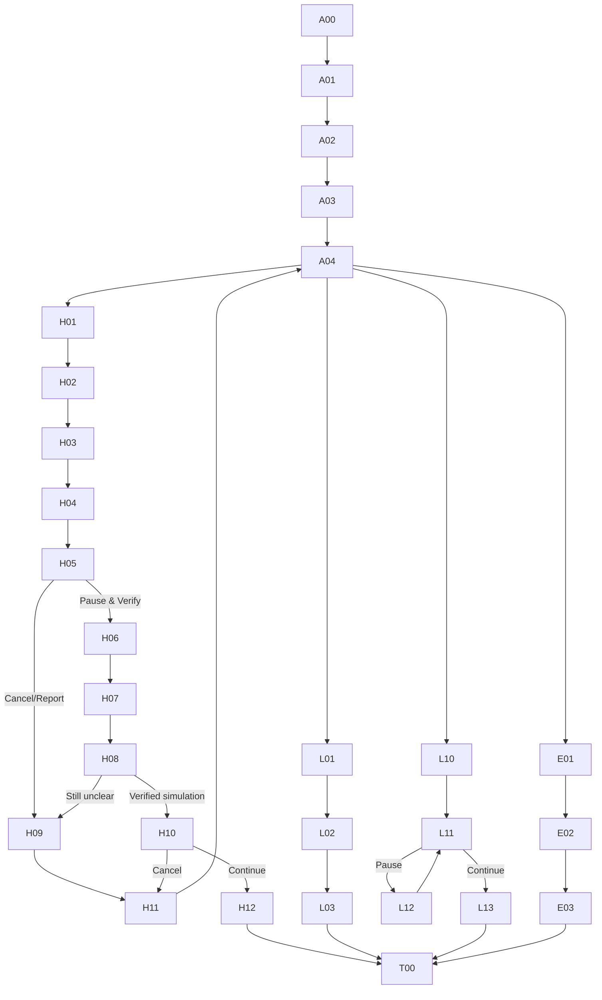

# K PLUS JobShield — Figma-Ready Clickable Flow Specification

สถานะ: Repository specification synced 5 กันยายน 2026; clickable Figma canvas built but latest copy sync is pending because the Starter MCP limit is active  
เจ้าของ final visual: สมาชิกคนที่สอง  
ขอบเขต: screen inventory, component states, prototype links และ test data สำหรับ clickable flow  
ไม่ใช่: official K PLUS design system หรือ final Proposal

ไฟล์เป้าหมาย: [K PLUS JobShield — Clickable Prototype](https://www.figma.com/design/5uoF2s6cq2JMGRFfwmdpc2)  
Workspace: Drafts ใน `Re: Verse's team`  
Implementation note: ไฟล์จริงย่อโครงสร้างจาก 7 pages ใน specification เป็น 3 pages (`00 Cover & Instructions`, `01 Foundations`, `02 Clickable Prototype`) เพื่อให้ prototype ทุก branch อยู่ใน page เดียวและจัดการ start points ได้ชัดเจน

## Current Scope Lock

- คำบนหน้าจอใช้ `เงินสำรองก่อนเงินเดือนแรก`
- Core เชื่อม 3 ส่วนเท่านั้น: `K-ePocket`, `K PLUS Transaction + Bank-side Fraud Risk` และ `K PLUS Security & Fraud Response`
- `Dynamic Time Lock` เป็นกลไกภายใน risk-based Cooling-off ไม่ใช่ฟีเจอร์แยก
- High-Risk Cooling-off พักเป็น `Pending Instruction` ก่อนส่งเข้าสู่ระบบโอน/PromptPay
- Email/Link scanning และ Fraud Specialist เป็น Optional/Future integration และไม่อยู่ใน Core flow
- Prototype ใช้ deterministic rules/policy กับ synthetic data; ไม่มี ML model และไม่แสดงผลลัพธ์เสมือนว่ามาจากโมเดลจริง

## Prototype Goal

ทำให้ผู้ทดสอบเข้าใจภายใน flow เดียวว่า JobShield:

1. เปิดใช้งานในช่วงหางานและผูกกับเงินสองวัตถุประสงค์
2. ประเมินบริบทก่อนโอนโดยไม่อ่านข้อความส่วนตัว
3. ใช้ friction ต่างกันสำหรับ suspicious, legitimate และ emergency transactions

## File Structure

```text
00 Cover & Instructions
01 Foundations
02 Components
03 Hero — High Risk
04 Legitimate — Low/Medium
05 Emergency — Break Glass
06 Testing Start Points
```

## Provisional Foundations

ใช้เป็น accessibility guardrails ไม่ใช่ official KBank tokens:

- Frame: mobile 390 × 844
- Layout grid: 4 columns, 16 px margins, 8 px spacing unit
- Type: Thai-capable sans-serif; 24 px page title, 20 px section title, 16 px body/button, 14 px supporting text
- Touch target: minimum 44 × 44 px
- Semantic colors: neutral/default, caution, critical, success; ทุก state ต้องมี label/icon ร่วมกับสี
- Contrast: body/action text เป้าหมาย WCAG AA; visual owner ตรวจด้วย Figma contrast plugin หรือ equivalent
- Components: Auto Layout และ variants เพื่อรองรับข้อความไทย/text scaling

## Component Inventory

| Component | Required variants | Content/data |
|---|---|---|
| `CareerModeCard` | off / setup / active / expiring | status, expiry, Manage action |
| `FundSourceCard` | Job Search Budget / เงินสำรองก่อนเงินเดือนแรก | available amount, purpose label |
| `PayeeRow` | own / known / verified biller / new unverified | name fixture, account alias, status text |
| `ReasonChip` | new payee / reserve / repeated / destination / job context | icon + plain Thai reason |
| `RiskBanner` | Medium / High | heading, maximum 3 reasons, no numeric score |
| `ActionButton` | primary / secondary / destructive / disabled | label and loading state |
| `PauseStatus` | held / verifying / eligible-to-continue / cancelled | explicit `พักคำสั่งไว้ก่อนส่งเข้าสู่ระบบโอน` state |
| `ReportOption` | call / in-app report / save details | prototype-only destination labels |
| `PrototypeTag` | simulation / assumption | used only on test/research frames |

## Global Navigation Rules

- Back preserves entered synthetic data until transaction is cancelled
- Close warning returns to review without sending payment
- `Pause & Verify` ไม่ส่งคำสั่งเข้าสู่ระบบโอนโดยตรง แต่สร้าง `Pending Instruction` ก่อนเข้าสู่ Cooling-off
- `Cancel transfer` always leads to a cancelled state stating the instruction was not sent
- `Report concern` is separate from cancellation and may be selected after cancel
- High continuation stays disabled until tester selects `จำลองว่าผ่านการตรวจสอบแล้ว`
- No frame displays a fixed cooling-off duration

## Flow A — Setup Career Mode

| Frame ID | Screen | Key content | Primary interaction | Destination |
|---|---|---|---|---|
| A00 | Test start | เลือก scenario สำหรับผู้ทดสอบ | `เริ่มตั้งค่า Career Mode` | A01 |
| A01 | Career Mode introduction | opt-in value, privacy note, expiry control | `เริ่มตั้งค่า` | A02 |
| A02 | Choose duration | synthetic start/end or auto-expiry | `ถัดไป` | A03 |
| A03 | Allocate money context | Job Search Budget + เงินสำรองก่อนเงินเดือนแรก cards | `ยืนยันการตั้งค่า` | A04 |
| A04 | Career dashboard | Mode active, two fund sources, demo transfer entries | เลือก scenario | H01/L01/E01 |

Copy constraints:

- บอกว่าใช้ transaction context ไม่ใช่อ่านข้อความ/อีเมล
- Job Search Budget/เงินสำรองก่อนเงินเดือนแรก เป็นการกำหนดวัตถุประสงค์บนความสามารถเดิม ไม่ใช่บัญชีเงินฝากชนิดใหม่
- มี `ปิด Career Mode` และวันหมดอายุที่มองเห็นได้

## Flow H — Hero High-Risk Scenario BC1-A

Synthetic fixture: ผู้ใช้กำลังโอน ฿7,900 จาก `เงินสำรองก่อนเงินเดือนแรก` ให้ผู้รับใหม่ โดยระบุว่าเป็นค่าอุปกรณ์ก่อนเริ่มงาน

| Frame ID | Screen | Key content | Interaction | Destination |
|---|---|---|---|---|
| H01 | Enter transfer | new payee fixture + ฿7,900 | `ถัดไป` | H02 |
| H02 | Choose source | Job Search Budget / เงินสำรองก่อนเงินเดือนแรก cards | เลือก `เงินสำรองก่อนเงินเดือนแรก` | H03 |
| H03 | Review transfer | payee, amount, source | `ตรวจสอบก่อนโอน` | H04 |
| H04 | Context question | “รายการนี้เกี่ยวกับค่าใช้จ่ายเพื่อสมัครหรือเริ่มงานหรือไม่” + skip | เลือก `ค่าอุปกรณ์/ค่าเริ่มงาน` | H05 |
| H05 | High-Risk warning | 3 observable reasons + ผลกระทบต่อเงินสำรองก่อนเงินเดือนแรก | `Pause & Verify` / `Cancel/Report` | H06 / H09 |
| H06 | Pause status | `พักคำสั่งไว้ก่อนส่งเข้าสู่ระบบโอน`; `ยังไม่ส่งเข้าสู่ PromptPay`; no fixed timer | `ตรวจสอบผ่านช่องทางอิสระ` | H07 |
| H07 | Independent verification guide | หาเว็บไซต์/เบอร์จากแหล่งทางการ ไม่ใช้ลิงก์ในข้อความ | `จำลองว่าตรวจสอบแล้ว` | H08 |
| H08 | Re-confirm after condition | outcome options: verified / still unclear | verified → H10; unclear → H09 | H10/H09 |
| H09 | Cancel and report | separate `ยกเลิกรายการ` and `แจ้งข้อกังวล` | confirm action | H11 |
| H10 | Final deliberate confirmation | shows risk reasons remain + user authority statement | `ยืนยันทำรายการต่อ` / `ยกเลิก` | H12/H11 |
| H11 | Cancelled state | instruction not sent; optional report handoff | `กลับหน้า Career Mode` | A04 |
| H12 | Transfer complete — test only | explicit simulation label | `จบภารกิจ` | T00 |

### H05 working copy fixture

Heading: `พักรายการนี้และตรวจสอบก่อน`

Reason list:

- `คุณยังไม่เคยโอนให้ผู้รับนี้`
- `รายการนี้ใช้เงินสำรองก่อนเงินเดือนแรก`
- `คุณระบุว่าเป็นค่าใช้จ่ายก่อนเริ่มงาน`

Impact line: `หากทำรายการ เงินสำรองก่อนเงินเดือนแรกของคุณจะลดลง ฿7,900`

Actions:

- Primary: `Pause & Verify`
- Secondary safety action: `Cancel/Report`
- Link: `ดูเหตุผลเพิ่มเติม`

Do not use: `ตรวจพบมิจฉาชีพ`, `ปลอดภัย 100%`, risk percentage หรือ fixed countdown

## Flow L — Legitimate Payment Paths

### L-A: BC2-A — planned expense to verified biller

| Frame | State | Interaction |
|---|---|---|
| L01 | ค่าสอบ ฿1,200; Job Search Budget; verified biller | `ตรวจสอบก่อนโอน` → L02 |
| L02 | Normal review; status text `ช่องทางชำระเงินที่ตรวจสอบแล้ว` | `ยืนยัน` → L03 |
| L03 | Success | `จบภารกิจ` → T00 |

Expected: ไม่มี Scam warning และไม่มี High-Risk Cooling-off

### L-B: BC2-B — legitimate but new unverified payee

| Frame | State | Interaction |
|---|---|---|
| L10 | ค่าเอกสาร ฿900; Budget; new payee | `ตรวจสอบก่อนโอน` → L11 |
| L11 | Medium warning: first-seen + unverified payment channel | `Pause & Verify` / `ยืนยันต่อ` → L12/L13 |
| L12 | Verification guidance | back to L11 |
| L13 | Success | `จบภารกิจ` → T00 |

Expected: ใช้ non-accusatory wording และ deliberate confirmation แต่ไม่มี High-Risk Cooling-off

## Flow E — Emergency Break-Glass BC3-A

Synthetic fixture: โอน ฿6,000 จาก `เงินสำรองก่อนเงินเดือนแรก` ไปบัญชีตนเอง

| Frame | State | Interaction |
|---|---|---|
| E01 | own-account transfer + เงินสำรองก่อนเงินเดือนแรก | `ตรวจสอบก่อนโอน` → E02 |
| E02 | Normal review with source reminder; no Scam warning | `ยืนยัน` → E03 |
| E03 | Success + เงินสำรองก่อนเงินเดือนแรกคงเหลือ | `จบภารกิจ` → T00 |

Expected: ไม่มี fixed delay; Prototype แสดงว่าเงินสำรองก่อนเงินเดือนแรกไม่ได้ถูกล็อกถาวร

## Flow T — Test End

| Frame | Content |
|---|---|
| T00 | “ภารกิจสิ้นสุด กรุณาหยุดที่หน้านี้” เพื่อให้ facilitator ถาม comprehension/feedback โดยไม่เฉลยเพิ่ม |

## Prototype Link Map



## Testing Start Points

สร้าง start point แยกเพื่อไม่ให้ผู้ทดสอบต้องทำ onboarding ซ้ำ:

- `START-SETUP` → A00
- `START-HIGH` → H01 โดย Career Mode active อยู่แล้ว
- `START-LEGIT-LOW` → L01
- `START-LEGIT-MEDIUM` → L10
- `START-EMERGENCY` → E01

## Figma Build Checklist

- [x] สร้าง page structure แบบย่อและ 31 screen frames ที่มี frame IDs ตาม flow
- [ ] สร้าง formal component variants — exploratory v1 ใช้ repeated Auto Layout patterns เพราะไม่พบ official K PLUS library; ให้ visual owner ตัดสินใจก่อน visual freeze
- [x] ใส่ Auto Layout, `Noto Sans Thai` และตรวจการ render ภาษาไทยแบบ spot-check; text-scaling stress test ยังไม่เสร็จ
- [x] เชื่อม prototype links ทุก branch — 44/44 reactions และไม่มี destination หาย
- [x] ตั้ง 10 testing start points รวม Generic/Contextual matched variants
- [x] ตรวจจาก link graph ว่า H05/H06 เกิดก่อน transfer success; latest copy ต้องย้ำว่า H06 คือ Pending Instruction ก่อนระบบโอน/PromptPay
- [x] ตรวจจาก link graph ว่า L01/E01 ไม่มี High warning
- [ ] ตรวจ keyboard/focus order เท่าที่ Figma รองรับ
- [ ] ตรวจ contrast ครบทุกหน้าจอ; semantic labels ถูกใส่แล้วและไม่ได้ใช้สีเป็นสัญญาณเดียว
- [x] ใส่ `Prototype simulation` ใน assumed states
- [ ] ให้ technical ownerตรวจ rule/wording และ visual ownerตรวจ hierarchy ก่อน test

## Blocker And Handoff

Figma plugin เชื่อมแล้วและสร้างไฟล์ได้สำเร็จ การตรวจโครงสร้างยืนยัน 31 screens, 44 working reactions, 10 start points และไม่มี missing destination ภาพ `A04` กับ `E02` ผ่าน spot-check เบื้องต้น แต่ Figma Starter plan ถึง MCP tool-call limit ระหว่างขอ screenshot เพิ่ม จึงยังไม่อ้างว่า latest scope/copy ถูก sync ลง canvas, full visual QA, contrast, focus order หรือ visual-owner review ผ่านแล้ว

ลำดับถัดไปต้องเป็น: visual owner เปิดไฟล์ตรวจหน้าหลัก โดยเฉพาะ `H05`, `H06`, Generic/Contextual test variants → pilot กับคนจริง 1 คน → แก้ Critical/High defects → จึงเริ่ม sessions จริง 5–8 คน ห้ามนับ automated audit หรือ expert walkthrough เป็น pilot participant
