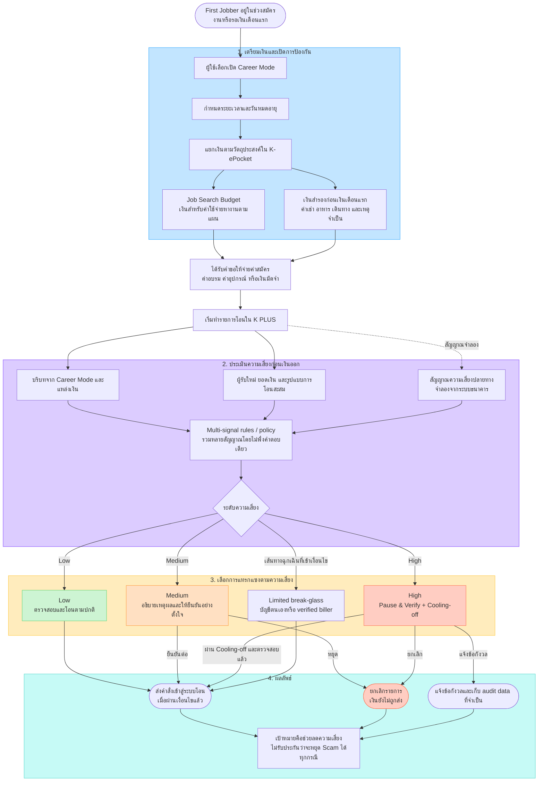
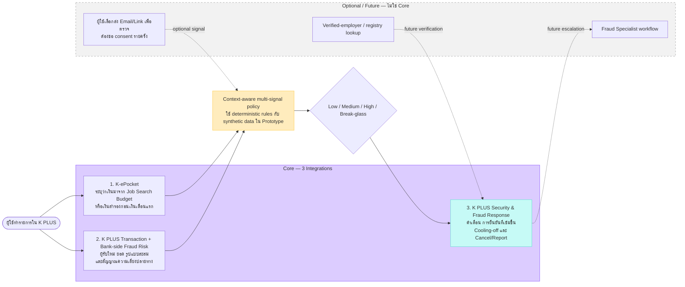
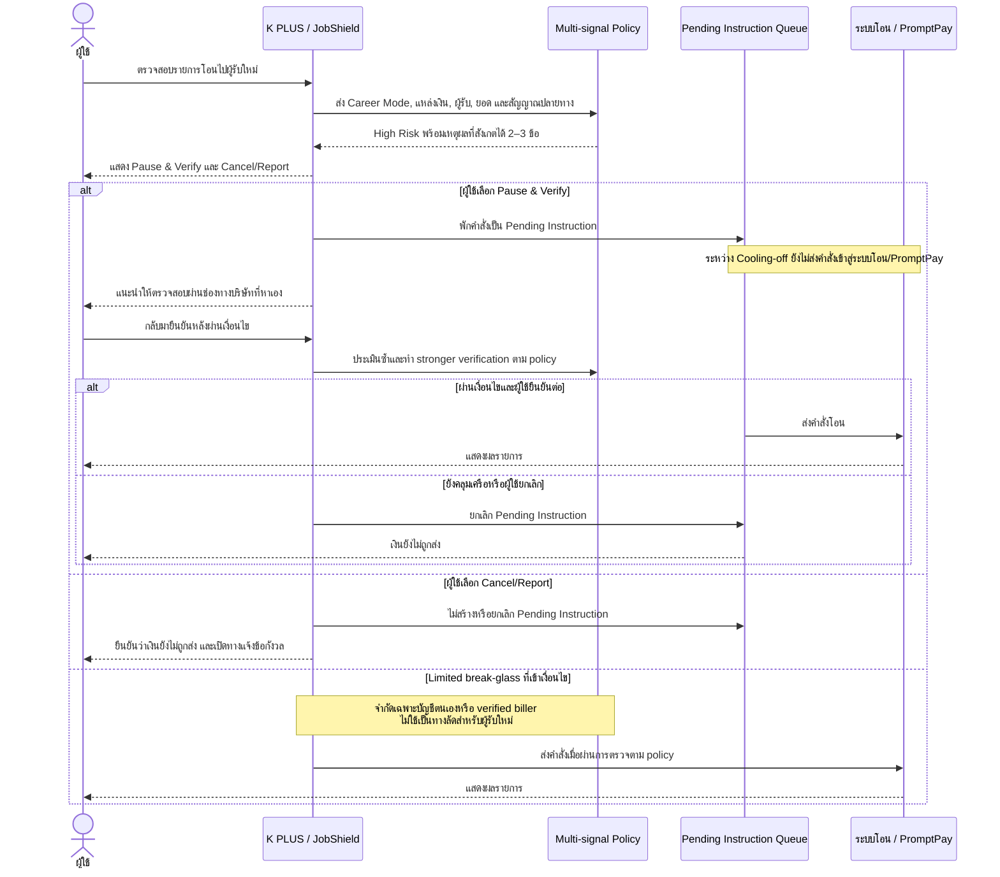

# K PLUS JobShield — System Diagrams

อัปเดตล่าสุด: 5 กันยายน 2026  
FigJam ชุดปัจจุบัน: [K PLUS JobShield — Detailed System Flow](https://www.figma.com/board/2Zucnsm9P4uPJdZ1BHVRv9)

ไฟล์นี้เป็น canonical Mermaid source ของ FigJam ชุดใหม่ มี 3 แผนภาพ:

1. End-to-End Flow — ตั้งแต่เปิด Career Mode จนรายการสำเร็จหรือถูกยกเลิก
2. Core Integrations and Risk Evaluation — แสดง 3 integrations และข้อมูลที่แต่ละส่วนรับผิดชอบ
3. High-Risk Cooling-off — แสดงว่าระบบพักคำสั่งก่อนส่งเข้าสู่ระบบโอน/PromptPay

## Diagram 1 — End-to-End Flow

## Diagram 2 — Core Integrations and Risk Evaluation

## Diagram 3 — High-Risk Cooling-off

## คำอธิบายสัญลักษณ์และขอบเขต

- เส้นทึบ = เส้นทางหลักหรือข้อมูลที่ Core ใช้จริงในแนวคิด
- เส้นประ = ข้อมูลจำลอง, Optional/Future integration หรือความเชื่อมโยงที่ยังไม่ยืนยัน
- `Destination risk` = สัญญาณจากระบบ Fraud Risk ฝั่งธนาคารที่ Prototype จำลองขึ้นด้วย synthetic flag; ทีมไม่ได้อ้างว่าเข้าถึงข้อมูลภายในจริง
- `Dynamic Time Lock` = กลไกที่ปรับระดับการพักตามความเสี่ยงภายใน Cooling-off ไม่ใช่ฟีเจอร์แยก และ Prototype ยังไม่กำหนดระยะเวลาจริง
- `Pending Instruction` = คำสั่งที่ถูกพักไว้ก่อนเข้าสู่ระบบโอน/PromptPay; จึงไม่ใช่การดึงเงินกลับหลังโอนสำเร็จ
- JobShield ไม่อ่านข้อความหรืออีเมลอัตโนมัติ Email/Link scanning จะมีได้เฉพาะส่วน Optional/Future และต้องขอ consent ทุกครั้ง
- Prototype ใช้ rules/policy และ synthetic data ไม่ได้มี ML model และไม่แสดงคะแนนที่อ้างว่าเป็นผลจากโมเดลจริง
- การทำรายการสำเร็จไม่ได้แปลว่าระบบรับรองนายจ้างหรือรับประกันว่าปลอดภัยจาก Scam
