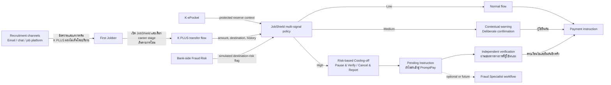

# K PLUS JobShield — Threat Model

> Superseded on 6 September 2026 by [threat-model-v5.md](./threat-model-v5.md). ไฟล์นี้เก็บ V4 lifecycle และชื่อเงินสำรองเดิมไว้เป็น prior threat model

สถานะ: Working threat model; Build/Protect scope synced — 6 กันยายน 2026
ขอบเขต: ปกป้องเงินที่ First Jobber กำหนดวัตถุประสงค์ไว้ เมื่อผู้ใช้กำลังสั่งโอนไปยังปลายทางภายนอกภายใต้ Scam/Fraud โดยใช้ Fake recruiter payment เป็น Hero Threat Scenario (`authorized push payment under social engineering`)
ไม่ใช่: production architecture, นโยบายจริงของ KBank หรือ final Proposal

## 1. Security Objective

ลดโอกาสที่ `เงินสำรองก่อนเงินเดือนแรก` หรือ `เงินสำรองฉุกเฉิน` จะออกไปยังผู้รับเสี่ยงโดยไม่มีการแทรกแซงที่เหมาะสม สร้างจังหวะให้ผู้ใช้หยุด ตรวจสอบ และยกเลิกรายการ **ก่อนส่ง payment instruction เข้าสู่ระบบโอน/PromptPay** พร้อมรักษาสิทธิในการทำธุรกรรมถูกต้องและเข้าถึงเงินยามฉุกเฉิน

ระบบไม่ได้รับประกันว่าจะหยุด Scam ได้ทุกกรณี โดยเฉพาะเมื่อผู้ใช้ยังเชื่อผู้โจมตีหลังครบ cooling-off และยืนยันทำรายการต่อ

## 2. Protected Assets And Security Properties

| Asset | สิ่งที่ต้องปกป้อง | Security property |
|---|---|---|
| เงินสำรองก่อนเงินเดือนแรก | เงินค่าเช่า อาหาร เดินทาง และค่าใช้ชีวิตก่อนเงินเดือนแรก | ไม่ถูกดึงไปยังผู้รับเสี่ยงโดยไม่มี proportional intervention |
| เงินสำรองฉุกเฉิน | เงินระยะยาวหลังเริ่มมีรายได้ สำหรับเหตุจำเป็นหรือช่วงรายได้สะดุด | ใช้ได้เมื่อจำเป็น แต่การโอนไปปลายทางเสี่ยงต้องผ่าน proportional intervention |
| Transaction intent | ความตั้งใจที่แท้จริงของผู้ใช้ ไม่ใช่แค่ตัวตนของผู้กด | มีโอกาสทบทวนและตรวจสอบโดยช่องทางอิสระ |
| User autonomy | สิทธิในการเข้าถึงและใช้เงินของตนเอง | High Risk ชะลออย่างมีเงื่อนไข ไม่ใช่ permanent lock |
| Privacy | Resume, email, chat และข้อมูลส่วนตัว | Transaction core ทำงานได้โดยไม่อ่าน private communications |
| Digital trust | ความเข้าใจว่าระบบเตือนเพราะอะไรและทำอะไรต่อได้ | เหตุผลอธิบายได้ ไม่กล่าวหาผู้รับ และมี Cancel/Report path |
| Audit evidence | เหตุผลและการตัดสินใจที่จำเป็นต่อ incident handling | เก็บเท่าที่จำเป็นตาม retention policy ที่ประกาศ |

## 3. Actors And Assumed Capabilities

### Primary user

First Jobber อายุ 22–30 ที่เปิด JobShield แบบ opt-in และเลือก `career stage/context` ของตนเอง ผู้ใช้อาจกำลังหางาน รอเงินเดือนแรก หรือเริ่มสร้างเงินสำรองฉุกเฉิน และอาจอยู่ภายใต้ความเร่งด่วนหรือคำแนะนำของผู้หลอกลวง แต่ไม่ได้ถูกสมมติว่า “ประมาท” หรือ “รู้เทคโนโลยีน้อย”

### Threat actor

Fake recruiter หรือเครือข่ายบัญชีรับเงินที่อาจ:

- แอบอ้างชื่อ โลโก้ โปรไฟล์ หรือโดเมนที่คล้ายบริษัทจริง
- ใช้ข้อมูลสาธารณะหรือข้อมูลที่รั่วไหลเพื่อทำ pretext ให้ดูน่าเชื่อถือ
- ขอค่าสมัคร ค่าอบรม ค่าอุปกรณ์ เงินประกัน หรือค่าดำเนินการก่อนเริ่มงาน
- สร้าง urgency และ coach ให้เหยื่อตอบ warning ผิดหรือกดยืนยันต่อ
- แบ่งยอดโอนเป็นหลายรายการ ใช้บัญชีรับเงินใหม่ หรือเปลี่ยนปลายทาง

ไม่สมมติว่าผู้โจมตีต้องยึดเครื่องหรือ credential ของเหยื่อสำเร็จ เพราะ core scenario คือผู้ใช้ล็อกอินและยืนยันเอง

### Defenders and dependencies

- `K-ePocket`: Core integration สำหรับกำหนดบริบทของ protected reserve ก้อนเดียว ซึ่งเปลี่ยนจากเงินสำรองก่อนเงินเดือนแรกเป็นเงินสำรองฉุกเฉินเมื่อผู้ใช้ยืนยัน
- `K PLUS Transaction + Bank-side Fraud Risk`: Core integration สำหรับข้อมูลรายการและสัญญาณความเสี่ยงปลายทาง
- `K PLUS Security & Fraud Response`: Core integration สำหรับคำเตือน stronger verification, Cooling-off และ Cancel/Report
- `Independent verification source`: ช่องทางบริษัทที่ผู้ใช้หาแยกจากข้อความต้องสงสัย; automated directory ยังเป็น Optional/Future integration
- `Fraud Specialist`: Optional/Future escalation; workflow/SLA จริงยังไม่ยืนยันและไม่ใช่ dependency ของ Core

## 4. System And Trust Boundaries

### Boundary B1 — External recruitment channel

K PLUS ไม่เห็น email/chat/call โดยอัตโนมัติ ข้อความจาก recruiter จึงอยู่นอก transaction core การ share Email/Link/QR เป็น Optional/Future integration และต้องขอ consent รายครั้ง

### Boundary B2 — User-provided context

JobShield state, career stage, purpose answer และ pocket designation เป็นข้อมูลที่ผู้ใช้ควบคุม อาจผิดพลาดหรือถูก attacker coach ได้ จึงใช้เพิ่มบริบทได้ แต่ห้ามเป็นสัญญาณเดียวหรือใช้เพื่อลด risk tier โดยลำพัง

### Boundary B3 — Bank-visible transaction data

Amount, destination identifier, source pocket และ transaction history อยู่ใน flow หรือคำนวณจากประวัติได้อย่างสมเหตุผล ส่วน recipient legal type ข้ามธนาคารและ fraud-graph detail ยังไม่ยืนยัน

### Boundary B4 — Payment execution

JobShield แทรกแซงได้ก่อนส่ง payment instruction เท่านั้น High Risk จะถูกพักเป็น `Pending Instruction` ก่อนเข้าสู่ระบบโอน/PromptPay และ `Cancel` หมายถึงยกเลิกรายการที่ยังไม่ execute ไม่ใช่เรียกเงินที่โอนเสร็จแล้วกลับคืน

### Boundary B5 — External verification

ข้อมูลติดต่อที่ใช้ตรวจสอบต้องมาจาก registry/เว็บไซต์ทางการที่ค้นหาแยกจากข้อความต้องสงสัย การทำ lookup อัตโนมัติและการรับรอง employer เป็น future integration

## 5. Attack Journey And Intervention Points

| Stage | Attacker action | สิ่งที่ K PLUS เห็น | Proposed control | Residual risk |
|---|---|---|---|---|
| 1. Targeting | ส่งประกาศ/อีเมล/ข้อความงานปลอม | ไม่เห็นโดยปริยาย | JobShield onboarding education; Optional/Future user-share | ผู้ใช้อาจไม่เปิด JobShield หรือไม่ share |
| 2. Trust building | ปลอมแบรนด์ สัมภาษณ์ หรือ offer ให้ดูจริง | ไม่เห็นเนื้อหาโดยปริยาย | ไม่อ้าง message inspection; เตรียม verification path | pretext อาจน่าเชื่อถือมาก |
| 3. Payment demand | ขอค่าสมัคร/อบรม/อุปกรณ์/มัดจำและเร่งเวลา | purpose เฉพาะเมื่อถามผู้ใช้ | Purpose เป็นหนึ่ง signal; contextual prompt | ผู้ใช้อาจตอบผิดตามคำสั่ง attacker |
| 4. Transfer setup | ให้โอนไปบัญชีใหม่หรือ QR | source, destination, amount, payee history | new-payee + fund-source + destination-risk evaluation | บัญชี mule ใหม่อาจยังไม่มี negative signal |
| 5. Bypass attempt | แบ่งยอด เปลี่ยน purpose หรือสั่งให้กดยืนยัน | cumulative transfer history และคำตอบปัจจุบัน | aggregate repeated transfers; self-report ห้ามลด tier | เปลี่ยนบัญชี/ช่องทางอาจลด signal continuity |
| 6. Authorization | ผู้ใช้ยืนยันรายการด้วยตนเอง | device/auth state และ policy result | contextual warning, pre-transfer cooling-off, independent verification | biometric ยืนยันคนกด ไม่ยืนยันว่าไม่ถูกหลอก |
| 7. User decision | หยุด ยกเลิก รายงาน หรือยืนยันต่อ | chosen action และ minimal audit event | Pause & Verify; Cancel/Report; limited break-glass | ผู้ใช้ยังอาจยืนยันหลังครบเงื่อนไข |
| 8. Post-decision | attacker เร่งซ้ำหรือย้ายช่องทาง | รายการใหม่และรูปแบบสะสม | reassess ทุก transaction; report handoff | ไม่รับประกัน freeze/recovery หลังโอน |

## 6. Threat-Control Matrix

| ID | Threat / abuse case | Security impact | Required signals | Control | Failure mode to test |
|---|---|---|---|---|---|
| T1 | Recruiter/บริษัทปลอมเรียกเงินก่อนเริ่มงาน | สูญเงินสำรองก่อนเงินเดือนแรก | career stage, destination, new-payee, optional purpose | contextual risk policy ก่อนโอน | บัญชีใหม่ยังไม่มี destination flag |
| T2 | ใช้บัญชีบุคคลหรือบัญชี mule ใหม่ | destination ดูไม่เคยมีประวัติเสีย | payee history, destination-risk integration | เพิ่ม friction เมื่อเป็น first-seen payee และมี signal อื่นร่วม | legal type ของผู้รับอาจไม่พร้อมใช้ |
| T3 | แบ่งยอดเพื่อหลบ threshold | สูญเงินสะสมโดยแต่ละยอดดูเล็ก | repeated count, cumulative amount/window | aggregate pattern ก่อนจัด tier | attacker เปลี่ยนหลายบัญชี |
| T4 | Coach ให้ตอบว่าไม่เกี่ยวกับงาน | purpose field ถูกใช้เป็น bypass | fund source, payee history, repetition, destination risk | self-declared answer เพิ่ม contextได้แต่ห้ามลด tier | user wording กำกวม |
| T5 | Coach ให้ผ่านทุก warning/face scan | user-authorized fraud สำเร็จ | High-Risk combination | cooling-off + independent channel + re-confirmation | ผู้ใช้ยังเชื่อ scammerหลังรอครบ |
| T6 | Warning fatigue จากค่าใช้ชีวิตจริงหรือการถอนเงินสำรองทั่วไป | ปิด JobShield หรือกดผ่านเป็นนิสัย | verified biller, known payee, history, withdrawal purpose | แยก dismissible Savings Nudge ออกจาก Fraud/Scam Intervention และใช้ positive signals ลด friction | verified directory ไม่ครอบคลุม merchant จริง |
| T7 | High-Risk control ขวางเหตุฉุกเฉิน | ผู้ใช้เข้าถึงเงินจำเป็นไม่ได้ | own account/verified biller, source | limited break-glass; no permanent lock | emergency ไป new payee ยังต้อง review |
| T8 | อ่านข้อความส่วนตัวเกินจำเป็น | privacy และ digital trust เสียหาย | explicit per-item consent only | transaction core ไม่อ่าน inbox; minimize retention | optional share อาจเก็บ content มากเกินไป |
| T9 | Warning เปิดเผย rule จน attacker optimize ได้ | detection evasion | observable reasons only | แสดงเหตุผล 2–3 ข้อ ไม่แสดง weights/thresholds | เหตุผลน้อยเกินไปจนผู้ใช้ไม่เข้าใจ |
| T10 | JobShield ไม่ถูกเปิดหรือ career stage ล้าสมัย | ไม่มีบริบทแหล่งเงิน/ช่วงชีวิตที่เพียงพอ | JobShield state, career stage | onboarding เมื่อจัด Pocket และให้แก้สถานะได้อย่างโปร่งใส | adoption ต่ำ; เหลือเพียง controls ปกติของธนาคาร |
| T11 | Savings Nudge ถูกตีความว่าเป็นผลตรวจ Scam | ผู้ใช้สับสนหรือไม่เชื่อคำเตือน High จริง | nudge type, fraud tier | ใช้ข้อความ ปุ่ม และ visual hierarchy คนละแบบ; Nudge กดข้ามได้ | ตัวละครหรือสีอาจทำให้ระดับความรุนแรงไม่ชัด |

## 7. Control Strategy — Defense In Depth

1. **Set up / Build:** ผู้ใช้เปิด JobShield เลือก career stage กันเงินสำรองก่อนเงินเดือนแรก และเมื่อมีรายได้จึงเปลี่ยนเป็นเงินสำรองฉุกเฉินพร้อม Auto-Routing แบบ opt-in
2. **Detect:** รวม source, first-seen payee, cumulative transfers และ simulated destination-risk; ไม่ตัดสินจาก purpose answer เพียงอย่างเดียว
3. **Explain:** แสดงเหตุผลที่สังเกตได้ 2–3 ข้อและจำนวน protected reserve ที่กำลังเสี่ยง โดยไม่กล่าวหาว่าผู้รับเป็นมิจฉาชีพ; Savings Nudge ต้องแยกจาก Fraud/Scam warning
4. **Interrupt:** Low ทำรายการปกติ, Medium ยืนยันอย่างตั้งใจ, High พักเป็น Pending Instruction ก่อนระบบโอน/PromptPay แล้วใช้ risk-based Cooling-off และ independent verification
5. **Recover/Report:** ผู้ใช้ยกเลิกรายการที่ยังไม่ execute และเข้าสู่ report path พร้อม minimal audit data; ไม่รับประกันเรียกเงินคืน

## 8. Security Requirements For The Prototype

- **SR-01:** High-Risk intervention ต้องพักเป็น Pending Instruction ก่อนส่งเข้าสู่ระบบโอน/PromptPay
- **SR-02:** purpose answer การเปลี่ยน career stage หรือการปิด JobShield ระหว่าง flow ต้องไม่ลด risk ของรายการปัจจุบันที่เกิดจาก transaction/destination signals โดยอัตโนมัติ
- **SR-03:** ระบบต้อง aggregate repeated/cumulative transfers เพื่อทดสอบ split-payment evasion
- **SR-04:** การแตะเงินสำรองก่อนเงินเดือนแรกหรือเงินสำรองฉุกเฉินเพียงอย่างเดียวไม่ทำให้เป็น High; ต้องมี signal อื่นร่วมเพื่อจำกัด false positives
- **SR-05:** destination-risk ระดับสูงทำให้เป็น High โดยไม่ขึ้นกับ purpose answer ใน prototype policy
- **SR-06:** own account/verified biller มี limited break-glass หากไม่มี destination-risk conflict
- **SR-07:** warning แสดง observable reasons สูงสุด 3 ข้อ พร้อม `Pause & Verify` และ `Cancel/Report`
- **SR-08:** transaction core ต้องทำงานได้โดยไม่มี email/chat/call access
- **SR-09:** ใช้ synthetic identities, account references และ events เท่านั้น
- **SR-10:** audit log ระบุ input category, triggered rule, tier และ user action แต่ไม่เก็บเนื้อหาข้อความส่วนตัว
- **SR-11:** Savings Nudge ต้องกดข้ามได้ทันทีและห้ามสร้าง Pending Instruction; มีเพียง Fraud/Scam policy ระดับ High ที่เรียก Cooling-off
- **SR-12:** การเปลี่ยนผ่านเงินที่เหลือไปยังเงินสำรองฉุกเฉินและ Auto-Routing ต้องใช้ explicit consent พร้อม pause/off/cap controls

## 9. Non-Goals

- ตรวจจับ credential phishing, account takeover, card fraud หรือ malware ทุกประเภท
- สร้าง ML model หรืออ้าง accuracy/precision จากข้อมูลจริง
- สร้าง employer registry หรือ fraud graph จริง
- ยืนยันว่าบริษัทหรือผู้รับเป็นมิจฉาชีพอย่างเด็ดขาด
- block เงินถาวร รับประกัน reimbursement หรือเรียกธุรกรรมที่สำเร็จกลับคืน
- แทนที่ K PLUS Lock Account, facial verification หรือ fraud controls ที่มีอยู่

## 10. Residual Risks And Decision Boundaries

- ถ้าผู้ใช้ไม่เปิด JobShield ระบบจะเหลือเพียงมาตรการปกติของธนาคาร จึงต้องทดสอบว่า onboarding และคุณค่าการสร้างเงินสำรองเพียงพอให้ opt-in หรือไม่
- หาก public/internal KBank controls มี recruitment-aware orchestration แบบเดียวกัน novelty จะลดลงและต้อง pivot ไปที่ UX/evaluation gap
- Cooling-off duration, regulatory authority และ cross-bank destination data ยังเป็น production unknowns ห้ามใส่ตัวเลขหรือรับประกันใน prototype
- หาก formative test แสดงว่าผู้ใช้แยก Savings Nudge จาก Fraud/Scam warning ไม่ได้ เข้าใจ contextual warning ไม่ดีกว่า generic warning หรือ legitimate flow ถูกขัดขวางจนไม่ต้องการใช้ JobShield ถือเป็น failure condition

## 11. Handoff To Synthetic Risk Table

ตารางทดสอบต้องพิสูจน์อย่างน้อยว่า:

1. fake recruiter + new payee + เงินสำรองก่อนเงินเดือนแรกถูกยกระดับเป็น High
2. legitimate essential expense + verified biller + เงินสำรองก่อนเงินเดือนแรกผ่านแบบ Low
3. emergency transfer จากเงินสำรองฉุกเฉินไป own account/verified biller ใช้ limited break-glass ได้
4. การถอนเงินสำรองฉุกเฉินเพื่อใช้จ่ายทั่วไปแสดง Savings Nudge แต่ไม่ถูกจัดเป็น Scam อัตโนมัติ
5. false purpose และ split payments ไม่ทำให้ risk ลดลง
6. รายการใหม่ที่คลุมเครือแต่ไม่มี strong combination อยู่ Medium เพื่อไม่กล่าวหาเกินหลักฐาน
